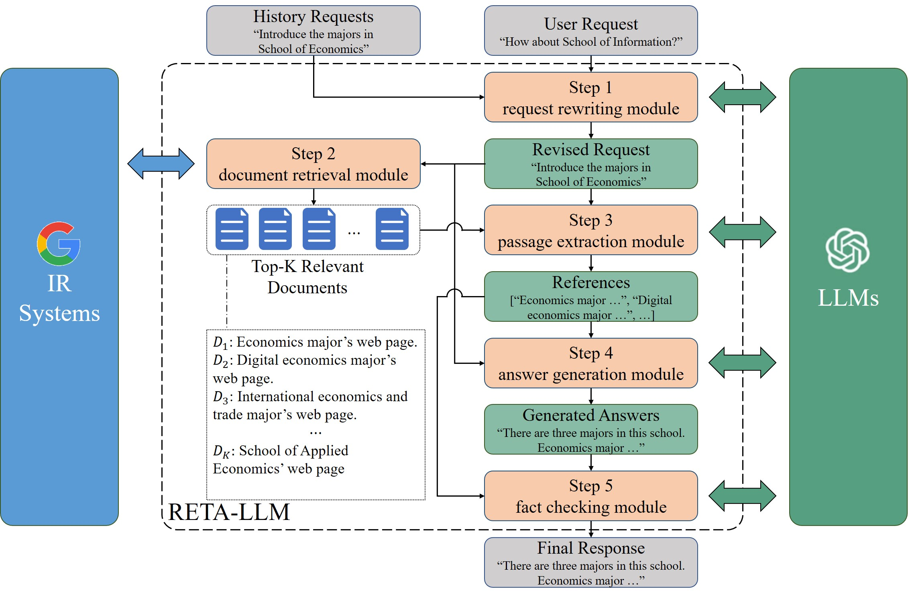

<div align=center>

<h1>RETA-LLM： A Retrieval-Augmented Large Language Model Toolkit</h1>
<a href="https://github.com/RUC-GSAI/YuLan-IR">
    
    
</div>


**RETA-LLM** is a **RET**reival-**A**ugmented LLM toolkit to support research in retrieval-augmented generation and to help users build their own in-down LLM-based systems.  RETA-LLM provides five plug-and-play modules to support better interaction between IR systems and LLMs, including **request rewriting, document retrieval, passage extraction, answer generation, and fact checking** modules. A complete pipeline are also provided for researchers and users to build their RETA-LLM toolkits based on their own repository for in-domain LLM-based systems from scratch. Our paper can be found at [paper](https://arxiv.org/abs/2306.05212).

## Table of Contents

- [Table of Contents](#table-of-contents)
- [Background](#background)
- [Introduction](#introduction)
- [Requirements](#requirements)
- [Usage](#usage)
- [Case](#case)
- [To-Do](#to-do)
- [Maintainers](#maintainers)
- [Acknowledgements](#acknowledgements)
- [License](#license)
- [Citation](#citation)


## Background

Large Language Models (LLMs) have shown extraordinary abilities in many areas. However, studies have shown that they still tend to hallucinate and generate responses opposite to facts sometimes. To solve these problems, researchers propose a new paradigm to strengthen LLMs with information retrieval systems (Retrieval-augmented LLMs), which enable LLMs to look up relevant contents from external IR system. Furthermore, by enhancing in-domain data resources, Retrieval-augmented LLMs can answer in-domain questions such as "Who is the dean of the Gaoling School of Artificial Intelligence of Renmin University of China?"

## Introduction

To support research in this area and help users build their own in-domain QA system, we devise **RETA-LLM**, a **RET**reival-**A**ugmented LLM toolkit. Compared with previous LLM toolkits such as Langchains, our RETA tookit focuses on retrieval-augmented LLMs and provides more optional plug-in modules. We also disentangles the LLMs and IR system more entirely, which makes you can customize search engines and LLMs.

The overall framework of our toolkit is shown as follows: 

In general, there includes five steps/modules in our RETA-LLM tookit. 

- **Request Rewriting**: First, RETA-LLM utilizes LLMs to revise current request of users based on their histories to make it complete and clear. 
- **Doc Retrieval**: Second, RETA-LLM uses the revised user request to retrieve relevant documents from customized document corpus. In our demo, we use [disentangled-retriever](https://github.com/jingtaozhan/disentangled-retriever) as retriever for html materials in Chinese. you can customize your own searcher.
- **Passage Extraction**: Third, since concatenating the whole relevant document content may be too long for LLMs to generate responses, RETA-LLM extracts relevance document fragments/passages by LLMs from the retrieved documents to form references for generation.
- **Answer Generation**: Fourth, RETA-LLM provides the revised user request and references for LLM to generate answers.
- **Fact checking**: Finally, RETA-LLM applies LLMs to verify whether the generate answers contain factual mistakes and output final responses for user request.

## Requirements
The requirements of our RETA-LLM toolkit is wrapped in the `environment.yml` file, install them by :

```
 cd the-root-path-of-this-repository 
 conda env create -f environment.yml
 conda activate retallm
 
 pip install adapter-transformers --force-reinstall
 pip install transformers==4.28.0 --force-reinstall
 git clone https://github.com/adapter-hub/adapter-transformers.git  
 mv adapter-transformers adaptertransformers

 #The above four lines are used to fix the conflicts between adapter-transformers and transfomers. Please don't adjust the order bewteen them.

```


## Usage

We provide a complete pipeline to help you use your own customized materials (e.g. html files crawled from websites) to build your own RETA-LLM toolkit. The pipeline is as follows:

0. Prepare your html file resouces in the `raw_data` folder and the mapping table file `url.txt` that maps the websited urls to the filename;  The `url.txt` should be in a tsv format. The format of each line is:

   `file name(without ".html") \t url`

   We give example data and url_file in `sample_data.zip` and `sample_url.txt`. 
   Follow the usage guidelines, you can build a RUC-enrollment-assistant using them.
   ```
   unzip sample_data.zip
   mv sample_data raw_data
   mv sample_url.txt url.txt
   ```

1. Run the `html2json.py` in the `html2json` folder to convert html resources to json files.
   ```
   cd html2json
   python html2json.py --input_dir ../raw_data --output_dir ../json_data --url_file ../url.txt
   python deduplication.py # This code is used to remove duplicated n-grams in the processed json files among all html files. 
   cd ..
   ```
   The `json_data` is the ouput data directory containing json files.
   
2. Run the `index_pipeline.py` in the `indexer` folder to build faiss-supported index. Specifically, this indexer is designed for materials in Chinese and English, if you want to index materials for other languages. please adjust `index_pipeline.py`.
   ```
   cd indexer
   python index_pipeline.py --index_type all  --data_dir ../json_data  --index_save_dir ../index --batch_size 128 --use_content_type all --train_dam_flag --language zh
   cd ..
   ```
   The `index` is the faiss-supported index directory. The args `--use_content_type` is used to indicate which parts (title, contents, all) of the documents is to used to build indexes. We suggest to conduct domain adaption with the args `--train_dam_flag`. If you choose not to, remove the `--train_dam_flag` args and change the `DAM_NAME` config in `./system/config.py` folder. 

3. Prepare an LLM and its generating configuration json file in the `system` folder. Example jsons for [YuLan-Chat](https://github.com/RUC-GSAI/YuLan-Chat), [ChatGLM](https://github.com/THUDM/ChatGLM-6B), [Alpaca](https://github.com/tatsu-lab/stanford_alpaca) is shown in `system/llm_*.json`. The genrating configuration mainly include the model path, temperature, top_p, top_k, etc. Specifically, you can even use differnt LLMs in different modules.

4. Run the `web_demo.py` in `system` folder to start serving. 
   ```
   cd system
   streamlit run web_demo.py --server.port 1241
   ```
   Then you can try your own RETA-LLM toolkit on server.ip:1241 !
   
   **The configuration of the `web_demo.py` is in the `config.py` in `system` folder**.  Please adjust the configuration if you use your own data. 
   
   For the LLMs, we provide the model loading and response template for [YuLan-Chat](https://github.com/RUC-GSAI/YuLan-Chat), [ChatGLM](https://github.com/THUDM/ChatGLM-6B), [Alpaca](https://github.com/tatsu-lab/stanford_alpaca) and ChatGPT in `load_model.py` and `model_response.py` in `system` folder, If you want to use other LLMs, please adjust these two files.

   For the searchers, we define a template for your customized searcher, see it in the `Common_Searcher` class in the `./system/searcher.py`.

## Case
   

   A case of in-domain QA supported by RETA-LLM is shown. In this case, we use the provided `sample_data` as external knowledge but conduct more fine-grained html parsing.


## To-Do
RETA-LLM is still under development and there are many issues that need to be solved with great efforts. We sincerely welcome contributions on this open source toolkit.
    
- [ ] Better fact checking module.
- [ ] Add parser for .doc / .pdf / .ppt resources.
- [ ] Add active retreival augumentation.
- [ ] More modulized and configurable.
- [ ] ...


## Maintainers
<div>
    <a href="https://github.com/rucliujn">@Jiongnan Liu</a>
    <a href="https://github.com/ignorejjj">@Jiajie Jin</a>    
</div>

    

## Acknowledgements
Thanks Jingtao for the great implementation of [disentangled-retriever](https://github.com/jingtaozhan/disentangled-retriever).


## License
RETA-LLM uses [MIT License](https://github.com/RUC-GSAI/YuLan-IR/tree/main/RETA-LLM/LICENSE). All data and code in this project can only be used for academic purposes.

## Citation
Please cite the following paper as the reference if you use our code. [paper](https://arxiv.org/pdf/2306.05212.pdf)

```
@misc{liu2023retallm,
      title={RETA-LLM: A Retrieval-Augmented Large Language Model Toolkit}, 
      author={Jiongnan Liu and Jiajie Jin and Zihan Wang and Jiehan Cheng and Zhicheng Dou and Ji-Rong Wen},
      year={2023},
      eprint={2306.05212},
      archivePrefix={arXiv},
      primaryClass={cs.IR}
}
```
