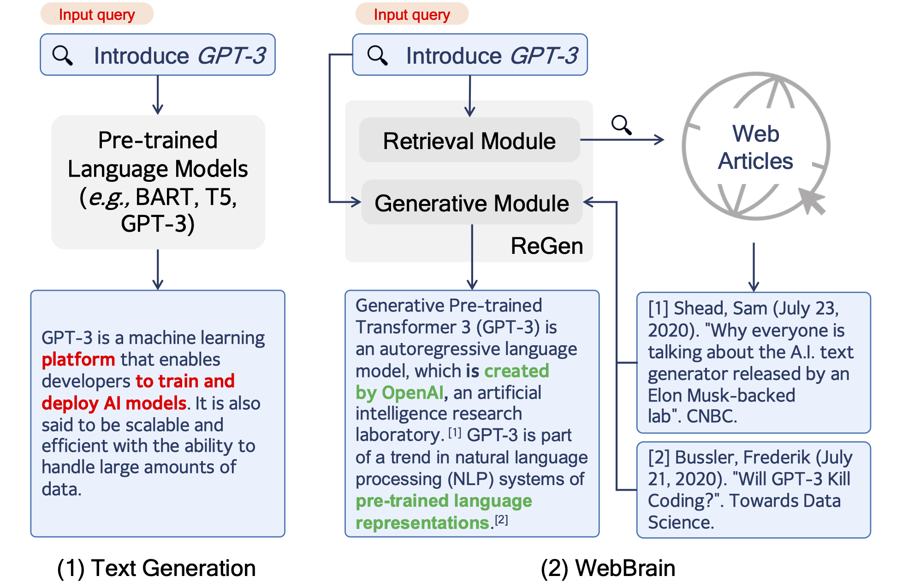

# WebBrain: Learning to Generate Factually Correct Articles for Queries by Grounding on Large Web Corpus

## Abstract

In this paper, we introduce a new NLP task -- generating short factual articles with references for queries by mining supporting evidence from the Web. In this task, called WebBrain, the ultimate goal is to generate a fluent, informative, and factually-correct short article (e.g., a Wikipedia article) for a factual query unseen in Wikipedia. To enable experiments on WebBrain, we construct a large-scale dataset WebBrain-Raw by extracting English Wikipedia articles and their crawlable Wikipedia references. WebBrain-Raw is ten times larger than the previous biggest peer dataset, which can greatly benefit the research community. From WebBrain-Raw, we construct two task-specific datasets: WebBrain-R and WebBrain-G, which are used to train in-domain retriever and generator, respectively. Besides, we empirically analyze the performances of the current state-of-the-art NLP techniques on WebBrain and introduce a new framework ReGen, which enhances the generation factualness by improved evidence retrieval and task-specific pre-training for generation. Experiment results show that ReGen outperforms all baselines in both automatic and human evaluations.

<p align="center">
  
  <br>
  <b>Figure 1</b>: Overview of WebBrain.
</p>

## Dataset

### Application form

To download the datasets, please complete and sign the application form and submit it to us. Upon receipt of the application form, we will provide you with a download password. 

**You are required to sign manually.**
[Application Form (pdf)](https://github.com/qhjqhj00/WebBrain-Data/blob/main/Application_Form.pdf)
[Application Form (markdown)](https://github.com/qhjqhj00/WebBrain-Data/blob/main/application_form.md)

The form is provided as markdown format which is easy to edit. When you finish the form, please save as pdf to send back.

Contact mail: ian[at]ruc.edu.cn


### Download
We offer two methods for downloading the WebBrain datasets. The first option is to download the datasets directly from our self-maintained servers using this [URL](http://playbigdata.ruc.edu.cn/webbrain/). Please send us the application form to acquire the password. 

The second option is to access the datasets via Baidu Cloud Disk, which is readily available in China. If you encounter any difficulties downloading the datasets using either method, please don't hesitate to contact us for assistance.

We understand that the size of these datasets (Terabytes) can make downloading challenging, so we are actively exploring additional options for hosting the data. We are committed to finding free and accessible alternatives and welcome any suggestions you may have.

You may download the sample data here: [Google Drive](https://drive.google.com/file/d/1WHu67PRSejw1NVkK4OLBtzGDfiXYZEYL/view?usp=sharing), [Baidu Cloud Disk](https://pan.baidu.com/s/1qBMb9QExAFn1YRqCZEZ5Tw?pwd=rdv9). 


**We provide the following datasets:**
| Dataset | Description | Download Link | Baidu Cloud Disk |
| --- | --- | --- | --- |
| WebBrain-Raw | Contains the raw text of WebBrain. It comprises 153 zipped data chunks in which each line is a Wikepedia page with its reference articles. | On the way | [Link](https://pan.baidu.com/s/1P-292IHuV9XMujIzPp82vw) |
| WebBrain-deduplicated | In WebBrain-Raw, multiple Wikipedia pages might use an identical web page as a reference, leading to redundancy. In this dataset, we deduplicate all reference articles and generate a standalone reference database. We only keep the reference's URL in the Wikipedia page data. | On the way | On the way |
| WebBrain-G(eneration) | This is a processed dataset for training and evaluating generation model. | On the way | On the way |
| WebBrain-R(etrieval) | This is a processed dataset for training and evaluating retrieval model. | On the way | [Link](https://pan.baidu.com/s/1xGq2VwxatppbCpRMvD07Eg) |

### Data format:
WebBrain-Raw contains 154 chunk files, which are in jsonline format.
Each line of data in WebBrain-Raw is in the following format:
```
{
   "url":"wiki_url",
   "title": "wiki_title"
   "text":"sentence_a <a href=\"wiki_hyperlink\">wiki_entry</a> sentence_b[1].
           <h2> section_title </h2> sentence_c.[2]"
   "text":"wiki_content",
   "references":[
      {
         "cite_id":"[1]",
         "title":"ref_title",
         "url":"ref_url",
         "text": "ref_content"
      },
      ...
   ]
}
```
For the Wiki pages, we keep necessary html tags to identify the Wiki section and the Wiki entry. The Wiki entry refers to the internal links to other Wiki page. 

WebBrain-R contains four files: train.tsv / dev.tsv / test.tsv and corpus.jsonl. 
The first three files are in the same format:
```
qid\tquery\tpositive_passage_id\tnegative_passage1_id\t...\n
```
And data in corpus.jsonl are in the fowllowing format:
```
{"id": "passage_id", "content": "passage_content"}
```

WebBrain-G contains train / dev / test files, which are in the following format:

```
[title] wiki_title [ref] [ref_id] ref_title ref_content [SPLIT] ... [SPLIT] target_text 
```
where we append the Wiki title to the front of each reference, merge all references and the target text (label) with a special token [SPLIT].


The statistic information is as follow:

### Statistics
#### Statistics of data for WebBrain-Raw.
| Dataset     | \# Wiki Pages | \# Refs   | Status        | Storage Size |
| ----------- | ------------- | ---------| ------------ | ------------ |
| WikiSum (Liu et al., 2018)      | 2.3M          | 87M      | Need crawling | 300GB        |
| WikiCatSum (Perez-Beltrachini et al., 2019) | 0.17M  | 23.5M    | Ready        | 4.8GB        |
| Hiersumm (Liu & Lapata, 2019)   | 1.66M | -        | Ready        | 6.9GB        |
| WebBrain-Raw | 14.86M        | 259.5M   | Ready        | 2.9TB        | 

#### Statistics of data for experiments.

|                       | WebBrain-R | WebBrain-G |
|-----------------------|------------|------------|
| \# Queries            | 2.74M      | 12.32M     |
| \# Ref. passages      | 3.20M      | 12.61M     |
| \# Tokens / Query     | 3.2        | 2.9        |
| \# Tokens / Passage   | 237.5      | 250.0      |
| \# Tokens / Target    | -          | 108.6      |
| \# Training           | 4.46M      | 12.30M     |
| \# Validation         | 0.2M       | 0.5M       |
| \# Test               | 88,935     | 24,546     |

In the paper, we evaluate a proposed model, ReGen on the WebBrain dataset. We release the source codes of ReGen in this Repo: [Link](https://github.com/qhjqhj00/WebBrain).

**For more information about the WebBrain datasets, please go to [this repo](https://github.com/qhjqhj00/WebBrain-Data).**


## Terms of Use

- The dataset is provided "as is" and without warranty or support of any kind.
- You may use the dataset for research and educational purposes only.
- You may not use the dataset for any commercial purpose, including without limitation any resale, license, or other exploitation of the data.
- You may not distribute or share the dataset with others without the prior written consent of the dataset owner.
- You must acknowledge the dataset owner and source (WebBrain) in any publication or presentation that makes use of the data.
- You have the right to request removal of your data from the dataset. The dataset owner will make reasonable efforts to remove your data within a reasonable time period, subject to technical limitations and legal requirements.
- The dataset owner may terminate your access to the dataset at any time for any reason.

## Code

### Requirements
- Python == 3.7
- PyTorch == 1.8.0
- Transformers >= 4.20

### Retriever training

```
cd retriever
sh train.sh
```

### Retriever evaluate
Modify the checkpoint path in retriever/eval.py 

```
cd retriever
python eval.py
```

### Corpus index 

```
cd retriever
sh index.sh
```

### Generator training
Step into the generator directory, and run the following script:
```
python /cache/code/run_model_train.py \
    --data_dir /cache/data/ \
    --save_ckpt_name generate.pt \
    --train_data_name data.train \
    --test_data_name data.valid \
    --per_gpu_train_batch_size 4 \
    --per_gpu_eval_batch_size 4 \
    --output_dir /cache/output/models/ \
    --result_dir /cache/output/result/ \
    --model_name_or_path /cache/pretrained_model/ \
    --config_name /cache/pretrained_model/ \
    --tokenizer_name /cache/pretrained_model/ \
    --learning_rate 5e-5 \
    --num_train_epochs 5
```


## FAQ

## Citation
See paper [here](https://arxiv.org/abs/2304.04358).

If you use the dataset in any publication or presentation, please cite:

```
@misc{qian2023webbrain,
      title={WebBrain: Learning to Generate Factually Correct Articles for Queries by Grounding on Large Web Corpus}, 
      author={Hongjing Qian and Yutao Zhu and Zhicheng Dou and Haoqi Gu and Xinyu Zhang and Zheng Liu and Ruofei Lai and Zhao Cao and Jian-Yun Nie and Ji-Rong Wen},
      year={2023},
      eprint={2304.04358},
      archivePrefix={arXiv},
      primaryClass={cs.CL}
}
```


## Star History

[](https://star-history.com/#qhjqhj00/WebBrain&Date)

